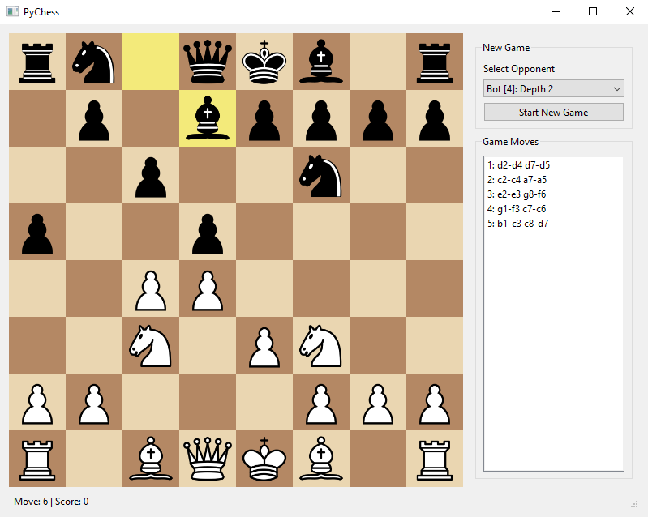

# PytChess
Simple chess game written in Python not using any engines and without studying any chess algorithms. Naive implementation for fun.

Features:
  - Core chess rules implemented
  - Ability to play human vs human
  - Ability to play vs a bot 
  - Several bots created with depth up to 3 levels



# Run instructions
```
pip install pyside6
python .\pytchess.py
```

# Test instructions
```
pip install pytest
pytest
```

# Package build instructions
```
pip install pyinstaller
pyinstaller --onefile --noconsole --add-data "resources;resources" pytchess.py
```

# ToDo list
  - Bots logic improvements
  - Ability to play for black
  - Promotion options (currently Queen is the only option)
  - En passant move
  - Threefold repetition: draw if the same position occurs three times during the game
  - Fifty-move rule: draw by 50 moves without captures and pawn moves

  