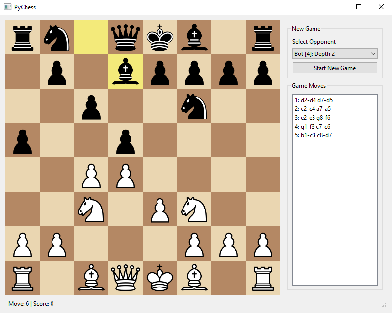

# PyChess
Simple chess game written in Python not using any engines and without studying any chess algorithms. Naive implementation for fun.



# Build and run instructions
```
pip install pyside6
python .\pychess.py
```

# Test instructions
```
pip install pytest
pytest
```

## ToDo list
  - Bots logic improvements
  - Ability to play for black
  - Promotion options (currently Queen is the only option)
  - En passant move
  - Threefold repetition: draw if the same position occurs three times during the game
  - Fifty-move rule: draw by 50 moves without captures and pawn moves

  